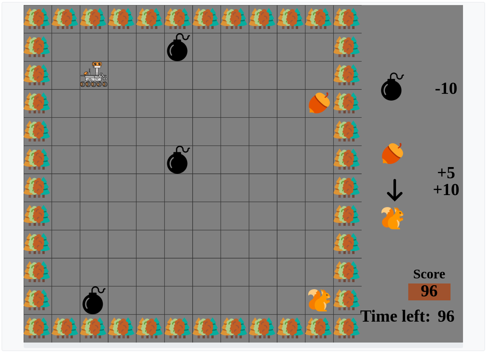
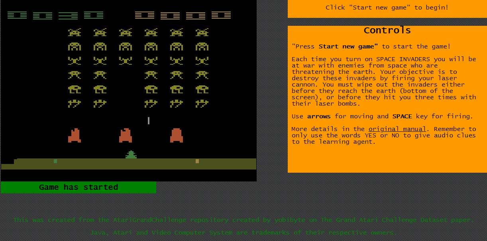

# This is the repository of the ICMI'24 contribution entitled: Prosody as a Teaching Signal for Agent Learning: Exploratory Studies and Algorithmic Implications
The repository is composed of two parts: 

1) wizard_of_0z, a remote platform for emulating online interactive learning scenarios with audio feedback, in which one participant gives audio feedback to the agent, and another participant remotely controls the robot as a response to that feedback. Even though it was designed to emulate an interactive RL scenario with evaluative feedback in a grid-world Robotaxi task, it can be built upon to richer and more diverse scenarios that involve audio or speech feedback.

2) javatari, an application allowing a user to provide Atari game demonstrations with audio as an additional channel.

# Citations
If you would like to build on this work, please cite us using the following:

Matilda Knierim, Sahil Jain, Murat Han Aydoğan, Kenneth Mitra, Kush Desai, Akanksha Saran, and Kim Baraka. 2024. Prosody as a Teaching Signal for Agent Learning: Exploratory Studies and Algorithmic Implications. In
INTERNATIONAL CONFERENCE ON MULTIMODAL INTERACTION (ICMI’24), November 4–8, 2024, San Jose, Costa Rica. ACM, New York, NY, USA, 29 pages. https://doi.org/10.1145/3678957.3685735
