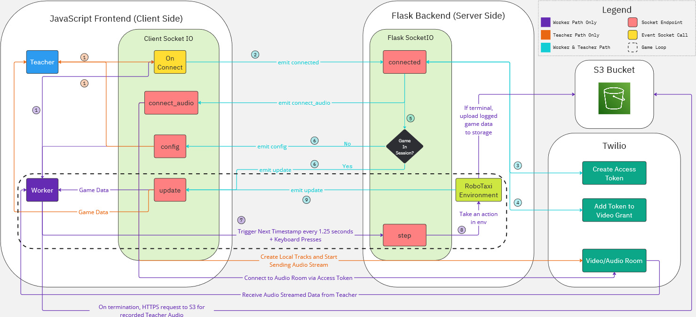

# interrl_exp
Code for the Experiment for the Wizard-of-Oz experiment for testing interactive audio reinforcement learning.

# Socket Diagram


# Local Installation
If you would like to run this codebase locally, please follow the below instructions.

### S3
In order to save the game data, you will need a S3 bucket for the server to upload game and audio data. Important note: you will need to pay money in order to set this service up. If you are affiliated with a university, typically you can get a free trial with a certain number of limited credits to offset this. Typically, S3 prices are fairly cheap, so unless you're dealing with a large volume of data, you don't need to worry too much.

To authenticate the codebase with your specific AWS Account, you can use AWS's authenticator/role-manager known as IAM. This IAM account will give you access codes (`AMAZON_CLIENT_KEY` and `AMAZON_SECRET_CLIENT_KEY`) for your application to connect to your S3 bucket. To create an IAM user, search for "IAM" in the search navigation bar at the top of the screen and select "Users". There should be a "Create User" button. Click it and give yourself a username.

Afterwards, you'll see a page for "Permission options". Select "Attach policies directly" and search for `AmazonS3FullAccess`. There should be a [+] button right next to where the name is present. Select it to give your IAM user full access to S3. Hit "Next" and then "Create user" to finalize your IAM user creation.

Now that an IAM user is created, you'll need to create an Access Key. Navigate to the "Users" page under IAM again and you should see your newly created IAM user. Click the hyperlink on the username and select "Create access key" in the top right. Select "Other" and the "Next" button, and then hit "Create access key" to finalize the access key. There, two values will be present: the Access Key and the Secret Access Key which will represent the `AMAZON_CLIENT_KEY` and `AMAZON_SECRET_CLIENT_KEY` respectively. **Please write this information down as you will be unable to retrieve these two values again.**

Next, you'll need to create an S3 bucket to hold your data. To create a bucket, search for "S3" in the navigation bar at the top of the screen. Make sure to select a region that is close to your deployment. If you would like to see the list of regions, select the dropdown next to your username in the top right corner of the dashboard. The region you select will become `AMAZON_REGION` later, so be sure to keep track of this value (Ex: us-west-2). After selecting a region, hit "Create bucket". The only two pieces of information you'll need to complete is setting the bucket name and and unchecking all of the boxes under "Block Public Access settings for this bucket". Afterwards, scroll down, hit "Create bucket" and your bucket should be created.

After creating the S3 bucket and IAM credentials, you'll need to modify the Permissions to fit the needs of your security policy of the S3 bucket. If you would like the easiest (and least secure) solution that simply works, add the following to the Bucket Policy and CORS Policy respectively.

#### Bucket Policy
Under the "Permissions" tab of your bucket, scroll down to "Bucket Policy":
```
{
    "Version": "2012-10-17",
    "Id": "<id_automatically_added>",
    "Statement": [
        {
            "Sid": "<sid_automatically_added>",
            "Effect": "Allow",
            "Principal": "*",
            "Action": "s3:*",
            "Resource": "arn:aws:s3:::<bucket_name>"
        }
    ]
}
```
#### CORS Policy
Under the "Permissions" tab of your bucket, scroll down to "Cross-origin resource sharing (CORS)":
```
[
    {
        "AllowedHeaders": [
            "*"
        ],
        "AllowedMethods": [
            "POST",
            "PUT",
            "DELETE",
            "GET"
        ],
        "AllowedOrigins": [
            "*"
        ],
        "ExposeHeaders": []
    }
]
```

### FFmpeg
In order to create playback recordings, you'll need FFmpeg. Installation instructions can be found [here](https://ffmpeg.org/download.html). This replay creation section of the application can be found at `http://localhost:5000/replay` once the application has started running.

### Twilio
You'll need to create a Twilio account if you would like to collect more training data. This repository uses voice websockets, and Twilio manages the voice aspect of this interaction ([link](https://www.twilio.com/en-us)). Twilio is also a paid-for service, but you are given a trial balance for 30 days in which all transactions should be covered. After creating a free account, you can find your `TWILIO_ACCOUNT_SID` by clicking your name in the top right corner and scrolling down on the "Overview" page until you find "User SID". Next, you'll need to setup an API key. Hit the "Account" dropdown in the top right corner of the screen, and select "API keys & tokens". There, hit the "Create API key ->" button and give the API key a name. After creating, your `TWILIO_API_KEY_SID` and `TWILIO_API_KEY_SECRET` will be available. Please save your API secret key somewhere safe since that key will not be disclosed to you again.

### Python (Linux or OSX)
Please make sure you have Python 3.9. If you are an Linux or OSX, simply run the following in a Python virtual environment of your choice (Conda, venv, etc.). An example creation call would be `conda create -n interactiveRL python=3.9.7`. After creating an environment, run the following:
```bash
make install
export S3_BUCKET_NAME=replace_with_your_bucket_name
export TWILIO_ACCOUNT_SID=insert_value
export TWILIO_API_KEY_SID=insert_value
export TWILIO_API_KEY_SECRET=insert_value
export AMAZON_CLIENT_KEY=insert_value
export AMAZON_SECRET_CLIENT_KEY=insert_value
export AMAZON_REGION=insert_value
make run-local
```
Once the application is up and running, navigate to `http://localhost:5000`. On the /login page, you will be prompted with a player ID. The player ID will be in the form of either T or W plus a four digit number (Ex: T0001 and W0001).

### Python (Windows)
Please make sure you have Python 3.9. If you are an Windows, simply run the following in a Python virtual environment of your choice (Conda, venv, etc.). An example creation call would be `conda create -n interativeRL python=3.9.7`. After creating an environment, run the following:
```shell
pip install --upgrade pip
pip install setuptools==65.5.0 pip==21
pip install wheel==0.38.0
pip install --user --upgrade setuptools
pip install -r requirements.txt
set S3_BUCKET_NAME=replace_with_your_bucket_name
set TWILIO_ACCOUNT_SID=insert_value
set TWILIO_API_KEY_SID=insert_value
set TWILIO_API_KEY_SECRET=insert_value
set AMAZON_CLIENT_KEY=insert_value
set AMAZON_SECRET_CLIENT_KEY=insert_value
set AMAZON_REGION=insert_value
python server.py
```

Once the application is up and running, navigate to `http://localhost:5000`. On the /login page, you will be prompted with a player ID. The player ID will be in the form of either T or W plus a four digit number (Ex: T0001 and W0001).

# Docker Installation
If you are on a Linux or OSX based system, you can run the following commands to initialize a docker instance of this project:

```
make docker
make docker-run
```

If you are on Windows, please run these commands manually:
```
docker build -t interactive-rl/server .
docker run --rm -i -t -v $(PWD):/app -w /app -p 0.0.0.0:5000:5000 interactive-rl/server
```

# Heroku Deployment
Since there is a docker container, you may deploy this codebase to a hosting service of your choosing. For our purposes, we used Heroku to deploy. If you would also like to deploy on Heroku, the instructions are below.

Firstly, attach your Github fork of this repository on the Heroku dashboard. Under the "Deploy" page, select a Github connection and select the forked name of the repository that resides in your account's namespace.

Secondly, you'll need to add the following buildpacks under the Settings tab (Note: Heroku only has a certain set of Python buildpacks that they support. Currently, they support Python 3.9.18, but this may change in the future):
```
heroku/python
https://github.com/jonathanong/heroku-buildpack-ffmpeg-latest.git
```
Finally, you'll need to add the `AMAZON_CLIENT_KEY` and `AMAZON_SECRET_CLIENT_KEY` to access your S3 bucket. You can get these values by setting up IAM as stated in the installation section. To add these values to Heroku, navigate to the Settings page and select "Reveal Config Vars". There, add `AMAZON_CLIENT_KEY` and `AMAZON_SECRET_CLIENT_KEY` to the environment variables with their corresponding values.

# Replays
To view the replay of an episode after the study has completed, simply navigate to the `/replay` url of the server (Ex: http://localhost:5000/replay). There, you'll be able to find a place to upload the recorded game data (a json) and an audio recording (wav). You can also export this as a video using FFMpeg if you'd like to see this recording later. If don't wish to download as a video, you can step through each round and see the rover's trajectory by using the slider or the arrow keys.

# Citations
- Code based on the [The EMPATHIC Framework for Task Learning from Implicit Human Feedback.](https://arxiv.org/abs/2009.13649): *Cui, Yuchen & Zhang, Qiping & Allievi, Alessandro & Stone, Peter & Niekum, Scott & Knox, W.. (2020). The EMPATHIC Framework for Task Learning from Implicit Human Feedback.*
- Original RoboTaxi code from the EMPATHIC paper was based of a [snake game built in pygame](https://github.com/YuriyGuts/snake-ai-reinforcement)